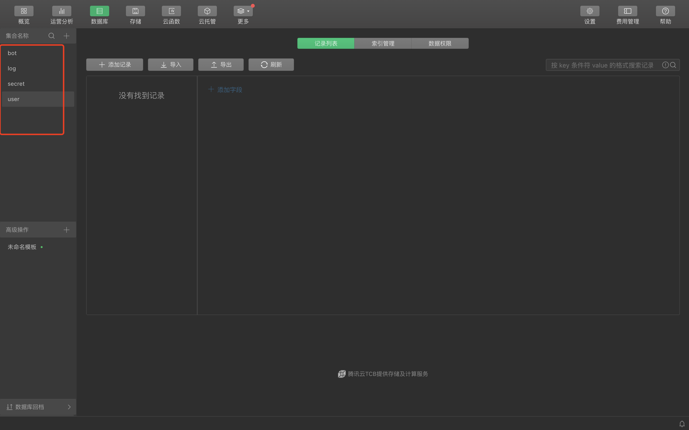
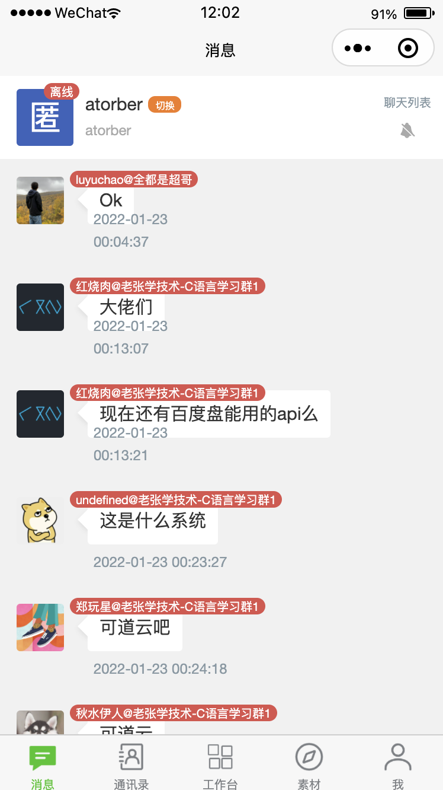
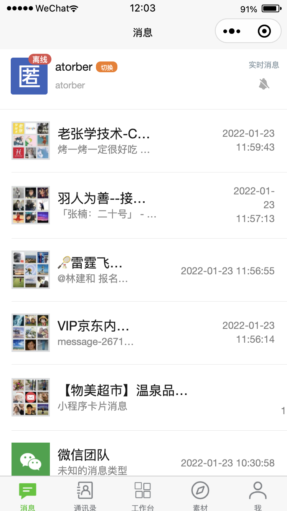
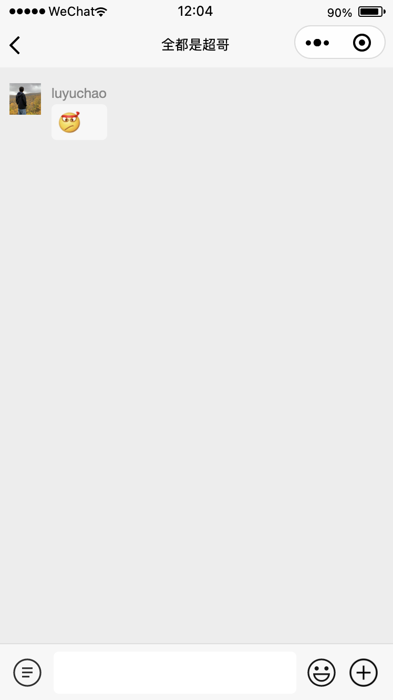
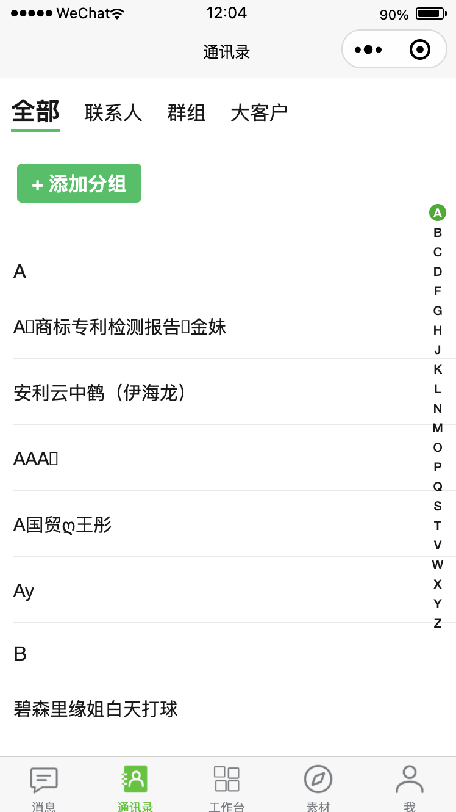
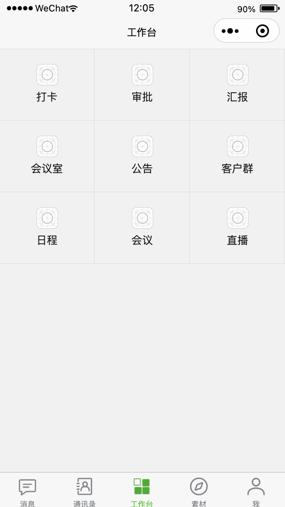
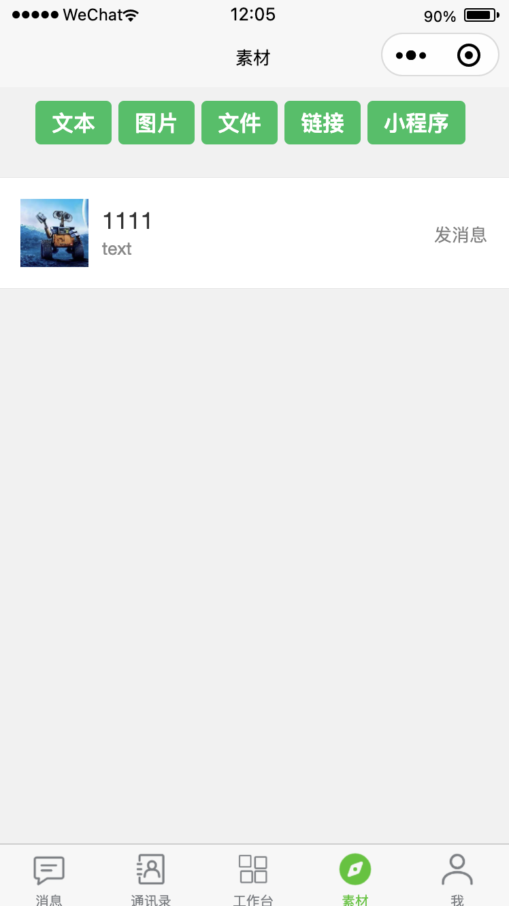
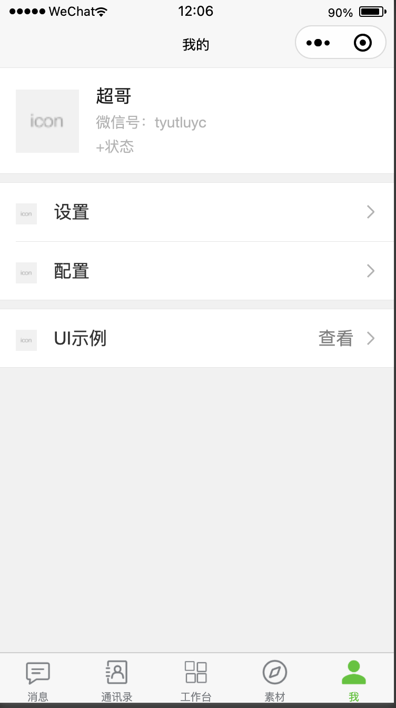

# chatbot微信小程序客户端

chatbot微信小程序客户端源码。

## 使用

### 配置信息

### 开发者工具

在小程序开发者工具云开发控制台下创建如下数据表



### 小程序客户端配置

在发布或预览小程序客户端，个人中心>配置 页面配置如下信息。

```
{
    "mqtt":{
        "botId":"机器人账号ID",
        "password":"MQTT密码",
        "username":"MQTT用户名"
    },
    "vika":{
        "ChatRecord":"表ID",
        "bot":"表ID",
        "group":"表ID",
        "material":"表ID",
        "spaceId":"空间ID",
        "token":"维格表token"
    }
}
```

> 1. 此项目基于微信小程序云开发方案，请先了解云开发的概念和使用方法

> 2. 特别注意此小程序中使用了维格表vika、百度云物联网核心套件，需开通相应账号获取资源配置信息

> 3. 客户端需配合[easy-chatbot-client](https://github.com/atorber/easy-chatbot-client)使用，请到小规模中查看使用方法

### 运行

```
cd miniprogram
npm i
```
完成上述步骤后，使用微信开发者工具，点击【工具-构建npm】

使用[微信开发者工具](https://developers.weixin.qq.com/miniprogram/dev/devtools/download.html)打开该示例代码，云开发环境搭建请参考[云开发示例说明](https://github.com/wechat-miniprogram/miniprogram-demo/blob/master/miniprogram/page/cloud/README.md)。


## 贡献

如果你有 bug 反馈或其他任何建议，欢迎提 issue 给我们。

如果你愿意一起来完善，欢迎通过 PR 的方式贡献代码。

## 截图

### 消息-实时消息模式



### 消息-聊天列表模式



### 消息-聊天窗口



### 通讯录



### 工作台



### 素材库



### 个人中心

